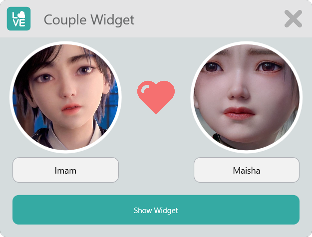

# CoupleWidgets

    

### Falling in love?
Keep your lover always with you!

### Feature
- ✅ Start on windows boot.
- ✅ Keep widget window position.

### Screenshots

    

### Package Used
- Newtonsoft

### Project Installation Prerequisite
- You must have a girlfriend or boyfriend.
- Visual Studio.
- Knowlege of C#, Xaml

## 🧑 Author

#### Md. Imam Hossain

You can also follow my GitHub Profile to stay updated about my latest projects:

If you liked the repo then kindly support it by giving it a star ⭐!

Copyright (c) 2022 MD. IMAM HOSSAIN
