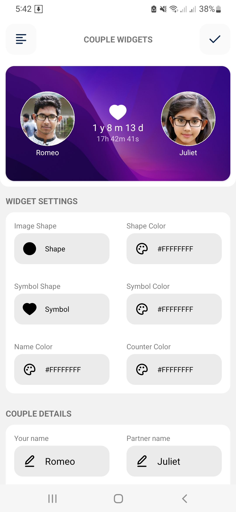
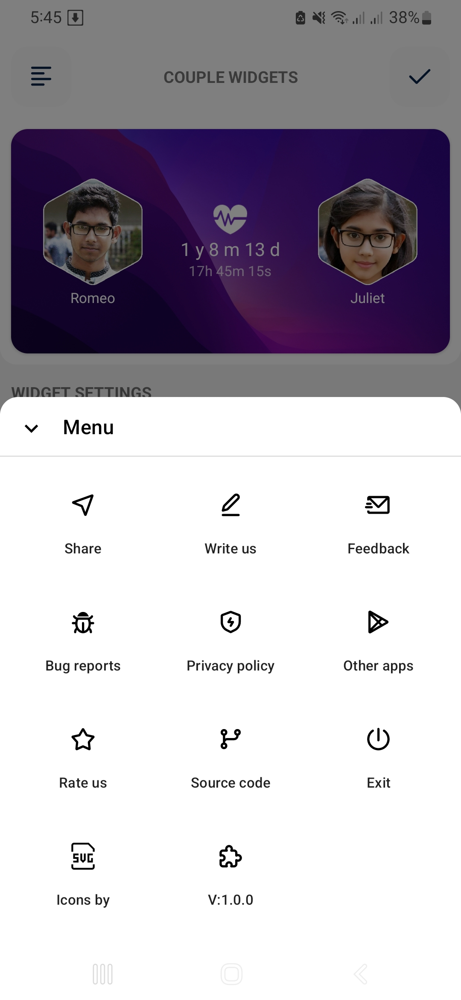
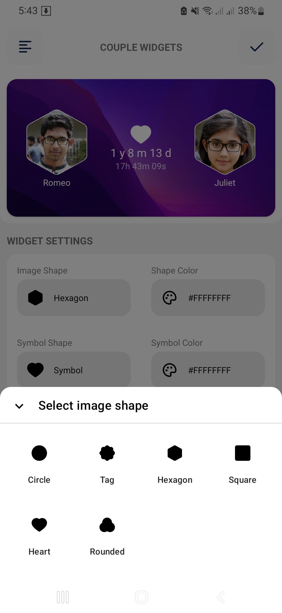
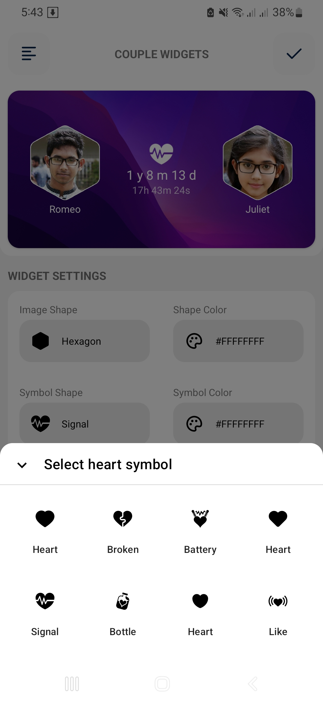
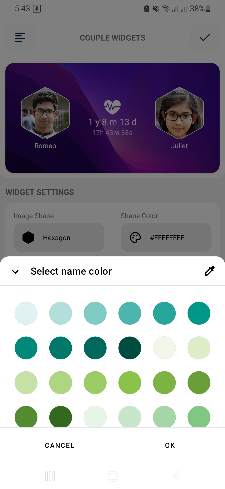
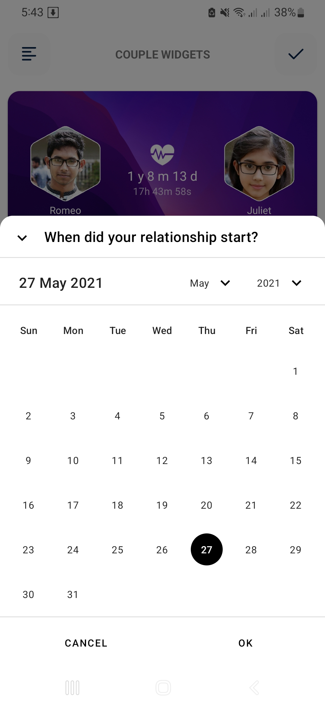
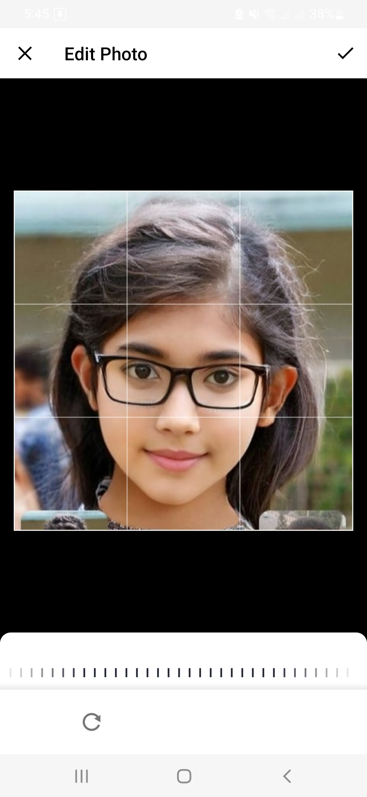
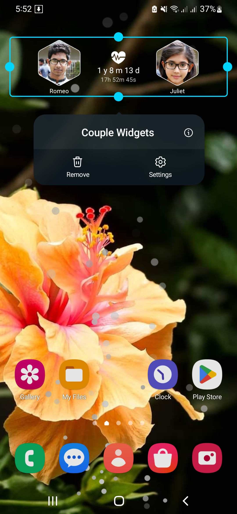

<h1 align="center">CoupleWidgets</h1>

  
  
  

  
Couple Widgets is an android home screen widget application based on modern Android application tech-stacks and MVVM architecture. 
App has 4x1 reconfigurable widget and integrating persisted data in the database via repository pattern.

 

### Falling in love?
* Keeping your loved one close to you requires effort and commitment from both partners.
* Maintaining open communication and showing affection are key to keeping the spark alive in any relationship.
* Spending quality time together, being supportive, and expressing gratitude are just some of the ways to ensure that your love continues to thrive.

### Couple Widgets for desktop
Please visit this repository <a href="https://github.com/imamhossain94/CoupleWidgetsWPF">CoupleWidgetsWPF</a>

## Screenshots

|          Home          |          Menu          |          Shape           |          Symbol           |
|:----------------------:|:----------------------:|:------------------------:|:-------------------------:|
|  |  |  |  |

|          Colors          |          Calender          |           Crop Image           |          Widget          |
|:------------------------:|:--------------------------:|:------------------------------:|:------------------------:|
|  |  |  |  |

## 💻 Installation steps

Clone or download this project in your working directory, Open using android studio, Sync the
project, build & run the project.

## 🧑 Author

#### Md. Imam Hossain

You can also follow my GitHub Profile to stay updated about my latest projects:

If you liked the repo then kindly support it by giving it a star ⭐!

Copyright (c) 2023 MD. IMAM HOSSAIN
